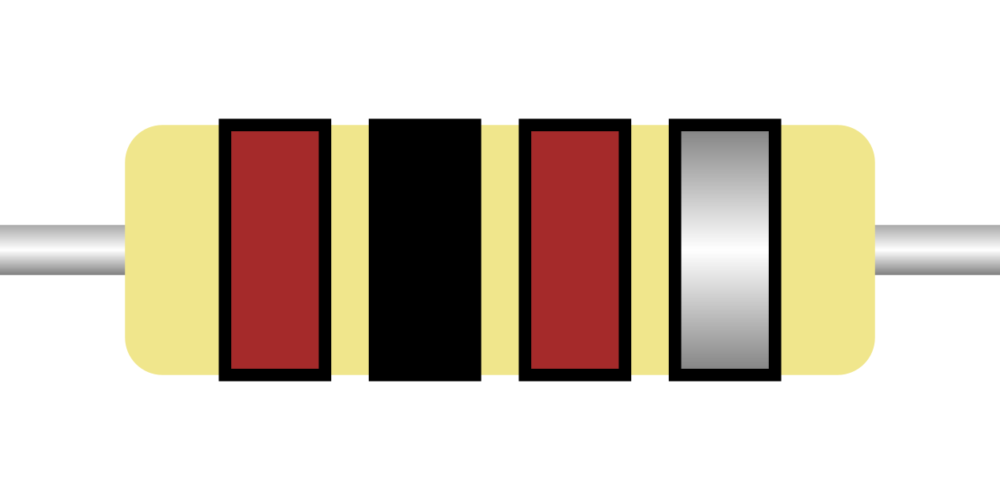
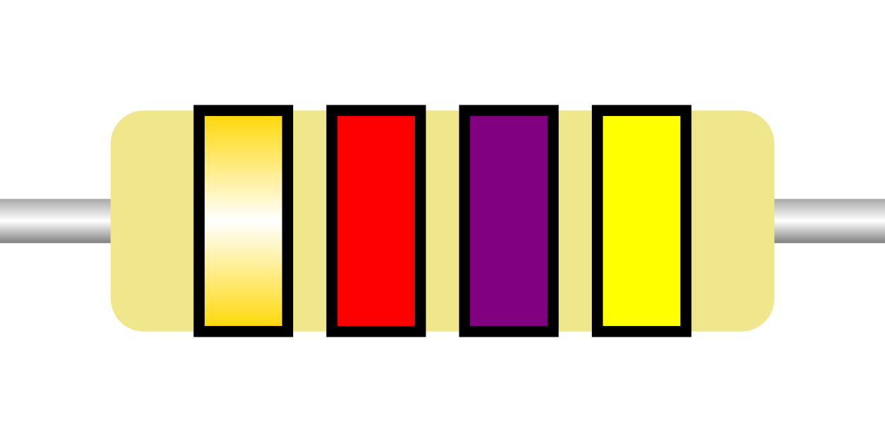
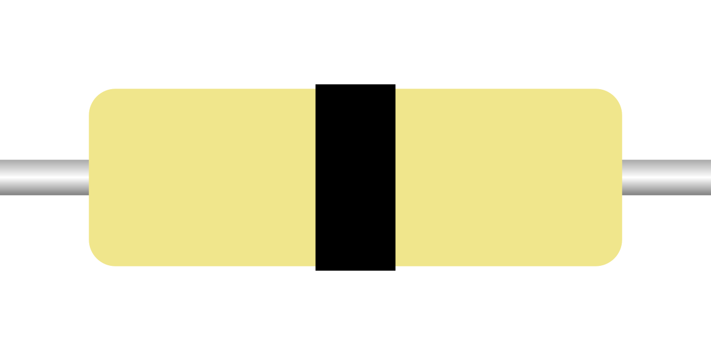

To learn resistor color codes,
I find it better to practice on example resistors
rather than try to [memorize the values of each color with mnemonics](https://en.wikipedia.org/wiki/List_of_electronic_color_code_mnemonics).
This script generates SVG images of 3 and 4-band resistors
in the E6, E12, and E24 series)[https://en.wikipedia.org/wiki/E_series_of_preferred_numbers]
as well as the zero Ohm resistor.
Note that some value might be unrealistically large,
e.g. most through-hole resistors are not in the giga-ohm range.

This can then be used with the TSV file to create a practice deck
for use with the Anki spaced repetition program.
The shared deck page is available on AnkiWeb here:

https://ankiweb.net/shared/info/1676222770

Example images (PNG previews instead of SVG):

100 Ohm ±10%

4.7 kOhm ±5% (reversed)

0 Ohm resistor

